# 📚 Deep Learning Application Repository

Deep Learning Application repository! This repository contains the code and resources developed for a university examination in Deep Learning. 

---

## 🔬 Laboratory Sessions Overview

Below is a detailed report of what was done for each laboratory, focusing on the teacher requests.

## **Lab 1: Introduction to Neural Networks and Basic Architectures**
**Objective**: Work with simple DNN architectures like MLPs and CNNs. Training them and see what happen adding more hidden layers or adding residual connections.
### 1.1 MLP
Implement a simple Multilayer Perceptron to classify the 10 digits of MNIST.
<details>
<summary>MLP architecture</summary>

```python
class MLP(nn.Module):
    def __init__(self, layers):
    super().__init__()
    self.layers = nn.ModuleList()
    for in_features, out_features in zip(layers[:-1], layers[1:]):
        self.layers.append(nn.Linear(in_features, out_features))

    def forward(self, x):
        x = x.flatten(1)
        for layer in self.layers[:-1]:
            x = layer(x)
            x = F.relu(x)
        x = self.layers[-1](x)  # Last layer
        return x
```
</details>

Results show that adding more hidden layers does not improve model performance significantly. 
The best accuracy is obtained with 2 hidden layers and a width of 512.
- MLP width 512, depth 2: 97.0% accuracy
- MLP width 512, depth 4: 97.4% accuracy
- MLP width 512, depth 10: 97.0% accuracy
- MLP width 512, depth 20: 96.0% accuracy

<p align="middle">
    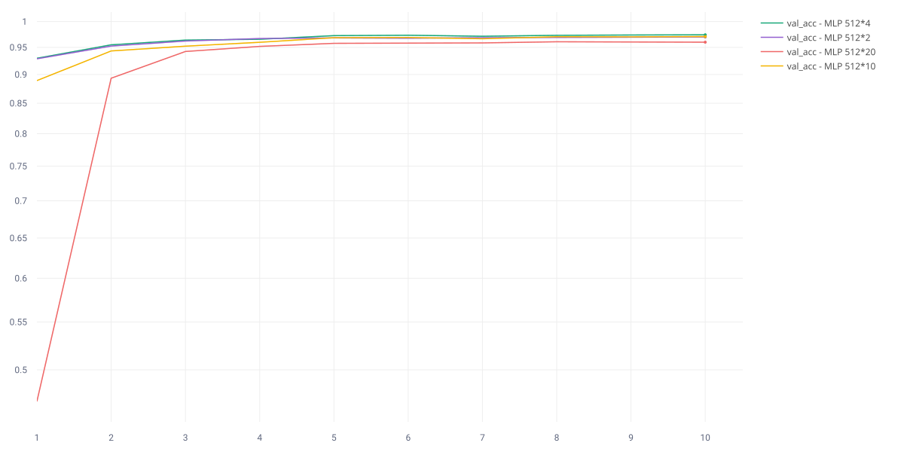
</p>

These results suggest that increasing depth beyond a certain point leads to a potential overfitting causing by the vanishing gradient problem.
 
### 1.2 Residual MLP
Implement an MLP with residual connections to mitigate the vanishing gradient problem.

<details>
<summary>Residual MLP architecture</summary>

```python
class ResidualBlock(nn.Module):
    def __init__(self, in_features):
        super().__init__()
        self.linear1 = nn.Linear(in_features, in_features)
        self.linear2 = nn.Linear(in_features, in_features)

    def forward(self, x):
        identity = x
        x = self.linear1(x)
        x = F.relu(x)
        x = self.linear2(x)
        x += identity
        return x


class ResidualMLP(nn.Module):
    def __init__(self, in_features, out_features, width, depth):
        super().__init__()
        self.layers = nn.ModuleList()
        self.layers.append(nn.Linear(in_features, width))
        for _ in range(depth-1):
            self.layers.append(ResidualBlock(width))
        self.layers.append(nn.Linear(width, out_features))

    def forward(self, x):
        x = x.flatten(1)
        for layer in self.layers[:-1]:
            x = layer(x)
            x = F.relu(x)
        x = self.layers[-1](x)  # Last layer
        return x
```

</details>

Now is possible to train deeper networks without performance degradation.
- Residual MLP width 512, depth 2: 97.6% accuracy
- Residual MLP width 512, depth 4: 98.2% accuracy
- Residual MLP width 512, depth 10: 98.4% accuracy
- Residual MLP width 512, depth 20: 98.4% accuracy

<p align="middle">
    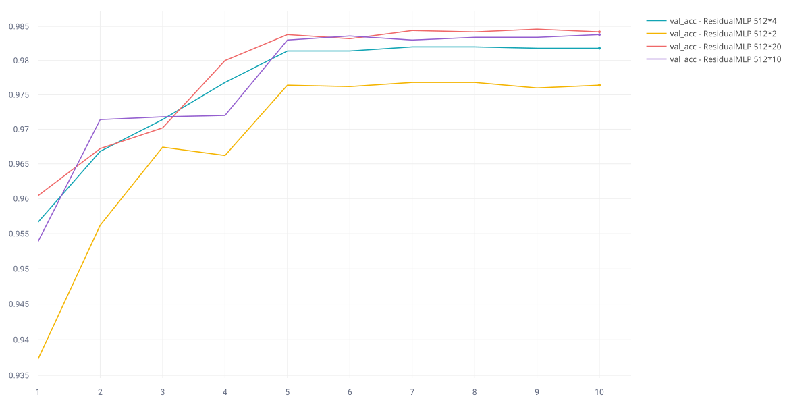
</p>

Detailed results are available on my [comet MLP](https://www.comet.com/france020800/mlp-vs-residualmlp/) project.

### 1.3 CNN and Residual CNN
Implement a simple Convolutional Neural Network (CNN) and a Residual CNN. \
The CIFAR-10 dataset is now used for image classification otherwise the architectural differences would not be visible on mnist.

<details>
<summary>CNN architecture</summary>

```python
class CNN(nn.Module):
    def __init__(self, in_channels, conv_channels, num_classes):
        super().__init__()
        self.convs = nn.ModuleList()
        self.bns = nn.ModuleList()  # Batch Normalization layers

        prev_channels = in_channels
        for out_channels in conv_channels:
            self.convs.append(nn.Conv2d(prev_channels, out_channels, kernel_size=3, padding=1))
            self.bns.append(nn.BatchNorm2d(out_channels))  # Add BatchNorm2d for each conv layer
            prev_channels = out_channels

        self.pool = nn.AdaptiveAvgPool2d((1, 1))
        self.classifier = nn.Linear(prev_channels, num_classes)

    def forward(self, x):
        for conv, bn in zip(self.convs, self.bns):
            x = F.relu(bn(conv(x)))  # Apply BatchNorm after convolution
        x = self.pool(x)  # shape: (batch, channels, 1, 1)
        x = x.view(x.size(0), -1)  # Flatten
        x = self.classifier(x)
        return x
```
</details>

Accuracy results:
- CNN channels [32, 32, 64, 64]: 62.0% accuracy
- CNN channels [32, 32, 64, 64, 128, 128]: 68.9% accuracy
- Residual CNN channels [32, 32, 64, 64, 128, 128]: 71.1% accuracy
- Residual CNN channels 2x[32, 32, 64, 64, 128, 128]: 74.7% accuracy

Deeper networks enhance performance, and residual connections further improve them by facilitating gradient flow.

<p align="middle">
    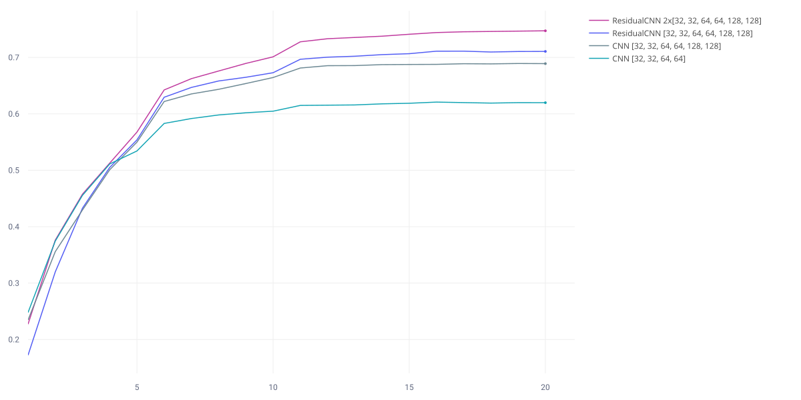
</p>

Given the same weights, convolutional networks with residual connections are also faster to train:
- 677k parameters CNN: 56.5% accuracy after 20 minutes
- 1.6M parameters Residual CNN: 74.7% accuracy after 5 minutes

<p align="middle">
    
</p>

Detailed results are available on my [comet CNN](https://www.comet.com/france020800/cnn-vs-residualcnn) project.

### 2.2 *Distill* the knowledge from a large model into a smaller one

In this section is shown the results of knowledge distillation to transfer knowledge from a large, pre-trained model (teacher) to a smaller model (student). \
The goal is to achieve comparable performance with reduced computational resources.

**Student model**: The best Residual CNN from previous section
- 78.5% accuracy on CIFAR-10 

**Teacher model**: A pre-trained ResNet-18 from torchvision
- 84.0% accuracy on CIFAR-10

**Student model after distillation**:
- 82.4% accuracy on CIFAR-10

<p align="middle">
    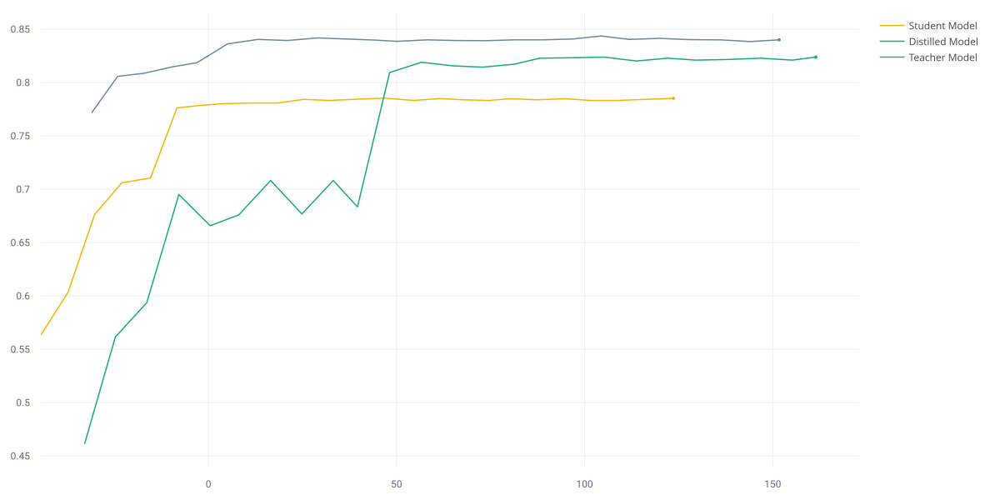
</p>

The student model after distillation achieves performance close to the teacher model.

Detailed results are available on my [comet DISTILLATION](https://www.comet.com/france020800/distilled-cifar10) project.

---

## **Lab 3: Working with Transformers in the HuggingFace Ecosystem**

**Objective**: Learn to work with the Hugging Face ecosystem to adapt models to new tasks.

### 1.1 Load and explore the *Rotten Tomatoes* dataset

The dataset contains 10,662 movie reviews, labeled as positive or negative and is structured with two columns: 
- **text** - review content 
- **label** - 0 = negative, 1 = positive

Furthermore is splitted into:
- **train** - 8530 reviews
- **validation** - 1066 reviews
- **test** - 1066 reviews

<details>
<summary>Positive and negative review examples</summary>

```python
{'text': 'the rock is destined to be the 21st century\'s new " conan " and that he\'s going to make a splash even greater than arnold schwarzenegger , jean-claud van damme or steven segal .', 'label': 1}
{'text': 'simplistic , silly and tedious .', 'label': 0}
```

</details>

### 1.2  Load the Distilbert model and corresponding tokenizer.
Load the distilbert-base-uncased model from Hugging Face and its corresponding tokenizer. \
Next use the tokenizer to preprocess a few examples from the dataset.

<details>
<summary>Code</summary>

```python
from transformers import AutoModel, AutoTokenizer

model = AutoModel.from_pretrained('distilbert/distilbert-base-uncased')
tokenizer = AutoTokenizer.from_pretrained('distilbert/distilbert-base-uncased')

# Take the first 3 samples
samples = train_data['text'][:3]

tokens = tokenizer(samples, padding=True, truncation=True, return_tensors='pt')
outputs = model(**tokens)
print('Model outputs:', outputs)
```

</details>

<details>
<summary>Output</summary>

```python
Model outputs: BaseModelOutput(last_hidden_state=tensor([[[-0.0332, -0.0168,  0.0194,  ...,  0.0476,  0.5834,  0.3036],
         [-0.0235, -0.0555, -0.3638,  ...,  0.1877,  0.5781, -0.1577],
         [-0.0516, -0.1014, -0.1511,  ...,  0.1503,  0.2649, -0.1575],
         ...,
         [ 0.3688, -0.1147,  0.8428,  ..., -0.0708, -0.0178, -0.2516],
         [ 0.0654, -0.0206,  0.1889,  ...,  0.1159,  0.2323, -0.2404],
         [ 0.0373, -0.0104,  0.1203,  ...,  0.1049,  0.2852, -0.3035]],

        [[-0.2062, -0.0490, -0.4036,  ..., -0.1186,  0.6141,  0.3919],
         [-0.4361, -0.1647, -0.3533,  ...,  0.1086,  0.9478, -0.0272],
         [-0.1164,  0.1690,  0.2698,  ..., -0.1971,  0.4372,  0.2527],
         ...,
         [-0.2341,  0.4810, -0.2634,  ..., -0.3397,  0.2567,  0.1274],
         [ 0.7139,  0.0574, -0.3260,  ...,  0.2041, -0.3800, -0.3343],
         [ 0.5649,  0.2806, -0.0295,  ...,  0.1297, -0.3160, -0.1874]],

        [[-0.2705, -0.1265, -0.0500,  ..., -0.3721,  0.2477,  0.3306],
         [ 0.0502,  0.0702, -0.0243,  ..., -0.5188,  0.5020,  0.0597],
         [-0.2193, -0.2208,  0.3721,  ..., -0.3424, -0.3176,  0.8824],
         ...,
         [ 0.2169, -0.3040, -0.2062,  ..., -0.2185, -0.3271, -0.2299],
         [ 0.1381, -0.2591, -0.2001,  ..., -0.2420, -0.2505, -0.1271],
         [ 0.0629, -0.2533, -0.1480,  ..., -0.2985, -0.1985,  0.0025]]],
       grad_fn=<NativeLayerNormBackward0>), hidden_states=None, attentions=None)
```

</details>

### 1.3 Extract feature and train a classifier
Use the Distilbert model to extract features from the reviews and train a simple SVM classifier. \
This will be the baseline for future experiments.

Results on test set:
Validation Accuracy: 82.0%

Validation Classification Report:

               precision    recall  f1-score

           0       0.80      0.85      0.82
           1       0.84      0.79      0.81

### 2 Fine-tune Distilbert
### 2.1 Tokenize the dataset splits
Use the Distilbert tokenizer to preprocess the entire dataset splits (train, validation, test). \
New dataset structure:

```python
Dataset({
    features: ['text', 'label', 'input_ids', 'attention_mask'],
    num_rows: 8530
})
```

### 2.2 - 2.3 Load and fine-tune Distilbert
Try to fine-tune the entire Distilbert model on the Rotten Tomatoes dataset. \
Training setup:
- **Model**: full trainable *distilbert-base-uncased* with a classification head
- **Epochs**: 3
- **Dataset**: first 1000 samples of the training set
Reached accuracy: **83.0%**

Another test on 20 epochs is done reaching the best accuracy of **85.3%** after about 2 hours of training.

Finetuning the entire Distilbert model is very expensive and prevents using the entire dataset due to limited computational resources. \
Training just 3 epochs requires about 20 minutes on *NVIDIA A2000 GPU*.

### 3.1 LoRA - Low-Rank Adaptation
Implement Low-Rank Adaptation (LoRA) to fine-tune only a subset of the model's parameters. 
This solution open the way to use the entire dataset and more epochs. \
The best results, balancing performance and training time, are achieved with:
- **LoRA rank (r)**: 8
- **LoRA alpha**: 32
- **LoRA dropout**: 0.1
- **Target layers**: query, value

<details>
<summary>All Hyperparameters</summary>
```python
hyper_param = {
        "r": 8,
        "epochs": 5,
        "batch_size": 16,
        "lora_alpha": 32,
        "lora_dropout": 0.1,
        "weight_decay": 0.001,
        "target_modules": ["q_lin", "v_lin"],
        "learning_rate": 2e-5,
        "scheduler_type": "cosine_with_restarts",
        "early_stopping_patience": 5,
        "early_stopping_threshold": 0.001
    }
```

</details>

Accuracy reached: **TODO**

<details>
<summary>Best accuracy configuration</summary>
```python
hyper_param = {
        "r": 8,
        "epochs": 25,
        "batch_size": 16,
        "lora_alpha": 32,
        "lora_dropout": 0.1,
        "weight_decay": 0.001,
        "target_modules": ["q_lin", "k_link", "o_link", "v_lin"],
        "learning_rate": 2e-5,
        "scheduler_type": "cosine_with_restarts",
        "early_stopping_patience": 5,
        "early_stopping_threshold": 0.001
    }
```

</details>

Detailed results are available on my [comet BERT](https://www.comet.com/france020800/bert) project.

---

## **Lab 4: Adversarial Learning and OOD Detection**
**Objective**: 
- develop a methodology for detecting OOD samples and measuring the quality of OOD detection 
- experiment with incorporating adversarial examples during training to render models more robust to adversarial attacks

### 1.1 Build a simple OOD detection pipeline
Use the CIFAR-10 dataset as in-distribution (ID) and as out-of-distribution (OOD):
- **Aquatic Mammals** CIFAR-100 subset
- **FAKEDATA** dataset

<details>
<summary>ID and OOD datasets</summary>

```python
train_id_dataset = torchvision.datasets.CIFAR10(root='./data', train=True, download=True, transform=transform)
test_id_dataset = torchvision.datasets.CIFAR10(root='./data', train=False, download=True, transform=transform)

ood_dataset = torchvision.datasets.CIFAR100(root='./data', train=False, download=True, transform=transform)
ood_indices = [i for i, target in enumerate(ood_dataset.targets) if target < 5]
cifar_ood_dataset = Subset(ood_dataset, ood_indices)
fake_ood_dataset = FakeData(size=1000, image_size=(3, 32, 32), transform=transform)

```
</details>

<p align="middle">
    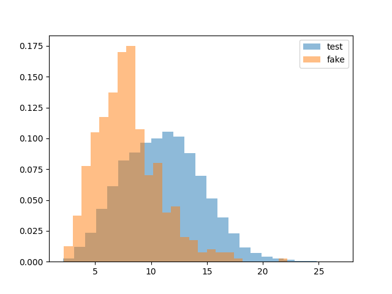
</p>

<p align="middle">
    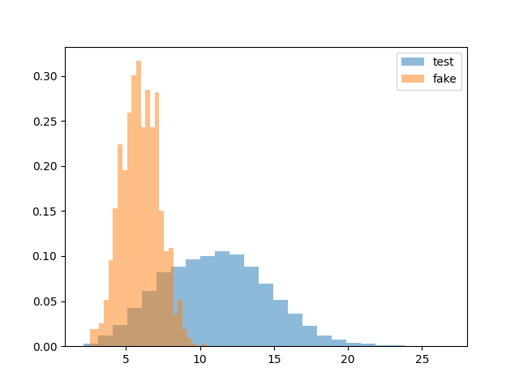
</p>

### 1.2 Measure OOD detection performance

Evaluate the OOD detection of the model with:
- Receiver Operating Characteristic (**ROC**) curve
- Precision-Recall (**PR**) curve.

<p align="middle">
  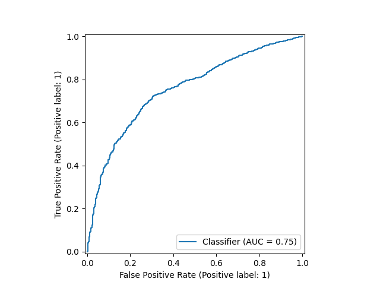
  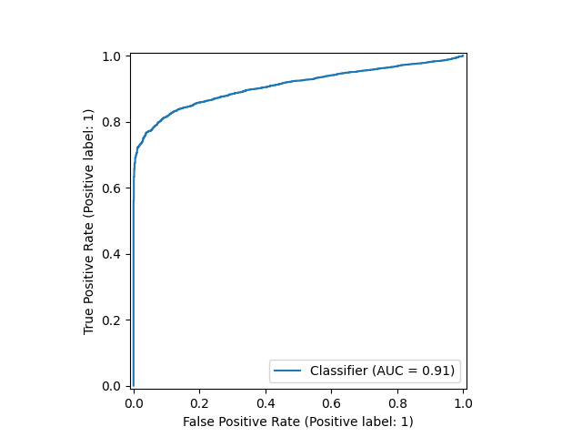
</p>

ROC scores:
- Aquatic Mammals: 0.75
- FAKEDATA: 0.91

<p align="middle">
  
  
</p>

PR scores:
- Aquatic Mammals: 0.98
- FAKEDATA: 0.99

OOD scores are higher on the FAKEDATASET as it contains images much further from CIFAR-10 than Aquatic Mammals.

### 2.1 Implement FGSM and generate adversarial examples
Implement the Fast Gradient Sign Method (FGSM) to generate adversarial examples for the CIFAR-10 dataset.

Some exaples of adversarial images generated with FGSM
<p align="middle">
  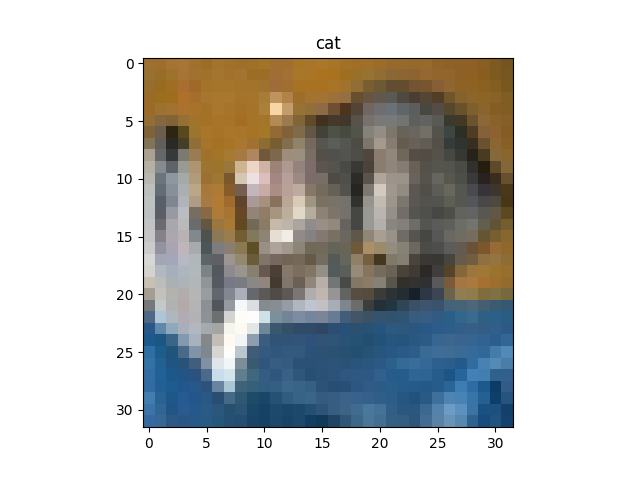
   Ship" style="flex: 1; max-width: 50%;">
  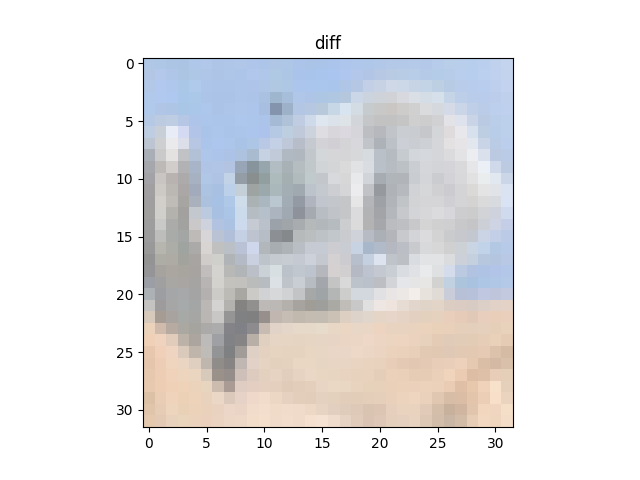
</p>

<p align="middle">
  
  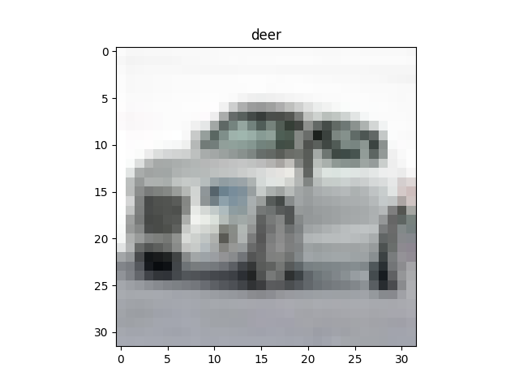 Deer" style="flex: 1; max-width: 50%;">
  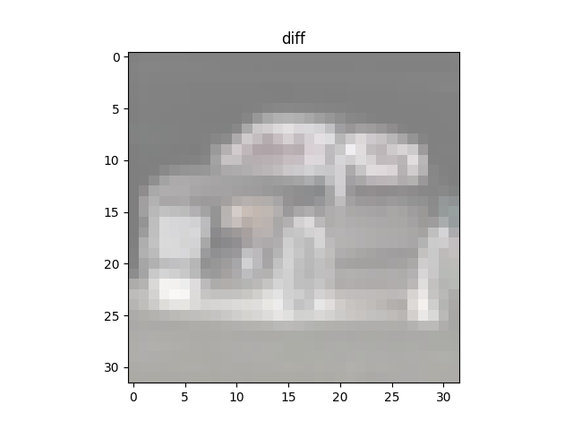
</p>

Added perturbation distribution plot on Automobile to Deer adversarial example:

<p align="middle">
  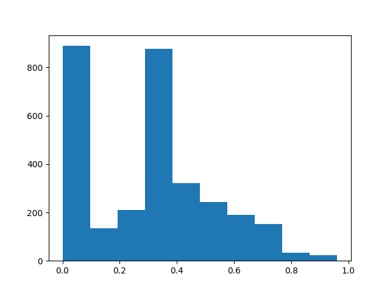
</p>

### 2.2 Augment training with adversarial examples
Working procedure:
- Generate an Adversarial Dataset
- Fine tune the previous model on the Adversarial Dataset
- Evaluate the new model on OOD detection task

A new Adversarial Dataset is created by augmenting the original training set with FGSM adversarial examples. \
*Lab4/adversarial_dataset_maker.py* script generates, with the same model of the previous exercise, adversarial examples for a subset of the CIFAR-10 training data and saves them to *Lab4/adv_dataset*.
- **Adversarial Dataset**: 5000 samples of ADV images with their original labels

Resnet18 model is fine-tuned on the Adversarial Dataset for 5 epochs. \
The fine-tuned model is then evaluated on the same OOD detection pipeline as exercise 1.

Results on **Aquatic Mammals** OOD dataset:
<p align="middle">
  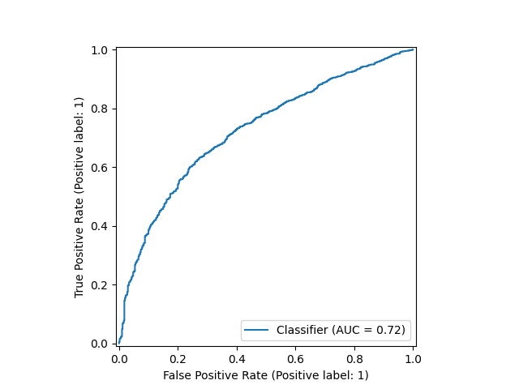
  
</p>

Results on **FAKEDATA** OOD dataset:
<p align="middle">
  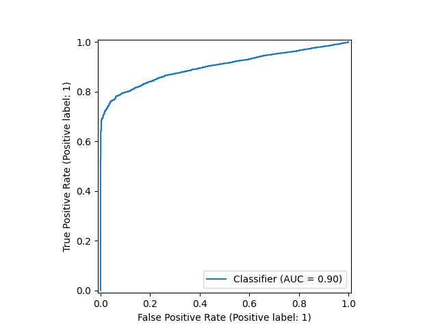
  
</p>

The ADV exposure got worse results on both OOD datasets:
- Aquatic Mammals: 
  - 0.75 -> 0.72 ROC score
  - 0.982 -> 0.978 PR score
- FAKEDATA: 
  - 0.91 -> 0.84 ROC score
  - 0.990 -> 0.989 PR score

### 3.1 Implement ODIN for OOD detection
Out-of-Distribution Detector for Neural Networks (ODIN) is implemented to enhance OOD detection.
The method involves:
- **Temperature (T)**: This parameter scales the logits. A higher temperature value softens the output probability distribution, which can make the model more confident in its ID predictions.
- **Perturbation (ϵ)**: This value controls the magnitude of the input perturbation.  The goal is to make the model's confidence in ID samples even higher, while OOD samples, which don't have a clear "correct" class, will show less of a confidence increase.

*Lab4/main_3.py* evaluates the performance of ODIN for each combination of T and ϵ using the ROC curve and PR curve scores.

Results on **Aquatic Mammals** OOD dataset:
- Best ROC score: 0.765
  - T = 10.0
  - epsilon = 0.001

---

## 📧 Contact

For any questions or inquiries, please open an issue in this repository or contact me directly.

---
